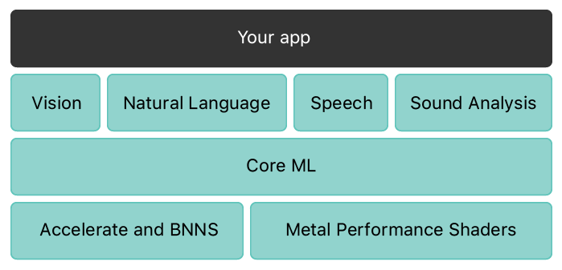
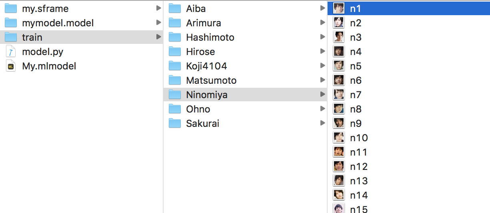

# Vision Core ML

## Overview
Use Vision framework and Core ML.


## Development
- XCode iOS Swift
- Apple Vision Framework
- Apple Core ML Framework

## You need to make a model

### Step1 Collect images in folders


### Step2 Run python
```python:model.py
import turicreate as tc
import os

data = tc.image_analysis.load_images('train', with_path=True, recursive=True)
data['label'] = data['path'].apply(lambda path: os.path.basename(os.path.dirname(path)))
data.save('Face.sframe')

train_data, test_data = data.random_split(0.9)
model = tc.image_classifier.create(train_data, target='label', max_iterations=100)

predictions = model.predict(test_data)
metrics = model.evaluate(test_data)
print('metrics=' + str(metrics['accuracy']))

model.save('Face.model')
model.export_coreml('Face.mlmodel')
```
```
python model.py
```
